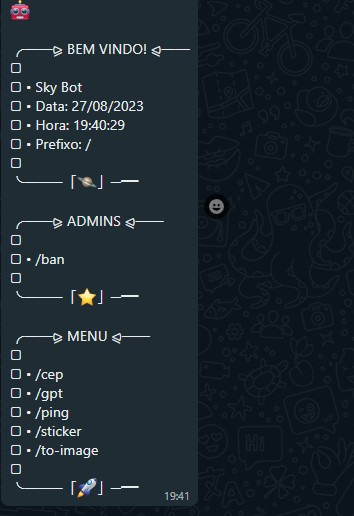

# SkyBot

<div align="center">
    
</div>

<br />

Bot de WhatsApp, desenvolvido nas aulas da [saga: desenvolvendo um bot de WhatsApp do zero](https://www.youtube.com/watch?v=GGm9zx_f8KA&list=PLO39CngmVGafypMifSUo7AueVU7P2_SEC).

Assista todas as aulas para entender como ele foi desenvolvido do zero!

<a href="https://www.youtube.com/watch?v=GGm9zx_f8KA&list=PLO39CngmVGafypMifSUo7AueVU7P2_SEC"></a>


## Tecnologias Envolvidas

- [Axios](https://axios-http.com/ptbr/docs/intro)
- [Baileys](https://github.com/WhiskeySockets/Baileys)
- [FFMPEG](https://ffmpeg.org/)
- [GPT OpenAI API](https://openai.com/blog/openai-api)
- [Node.js](https://nodejs.org/en)

## Instalação no Termux

1 - Abra o Termux e execute os seguintes comandos. (Não tem o Termux? [Clique aqui e baixe a última versão](https://www.mediafire.com/file/082otphidepx7aq/Termux_0.119.1_aldebaran_dev.apk/file))
```
pkg upgrade -y && pkg update -y && pkg install nodejs-lts -y && pkg install git -y && pkg install ffmpeg -y
```

2 - Habilite o acesso da pasta storage, no termux.
```
termux-setup-storage
```

3 - Entre na pasta storage (ou dê antes um `ls` e veja qual é o nome da pasta do seu cartão de memória e entre nela).
```
cd storage
```

4 - Clone o repositório.
```
git clone https://github.com/guiireal/sky-bot
```

5 - Entre na pasta que foi clonada.
```
cd sky-bot
```

6 - Execute o bot e depois leia o QRCode.
```
npm start
```

7 - Após ler o QRCode, aguarde 10 segundos, depois digite `CTRL + C` para parar o bot e rode novamente o seguinte comando.
```
npm start
```

## Para utilizar o GPT

Edite a linha `12` do arquivo `./src/config.js` e cole sua OpenAI Api Key. Caso não saiba como obter sua api key, assista o [vídeo 07 da saga: desenvolvendo um bot de WhatsApp do zero](https://www.youtube.com/watch?v=a3RNJ1DwN_E&t=352s)

```js
exports.OPENAI_API_KEY = "coloque_aqui_seu_token_da_openai";
```

## Exemplo do Menu



## Licença

[MIT](https://github.com/guiireal/sky-bot/blob/main/LICENSE)
