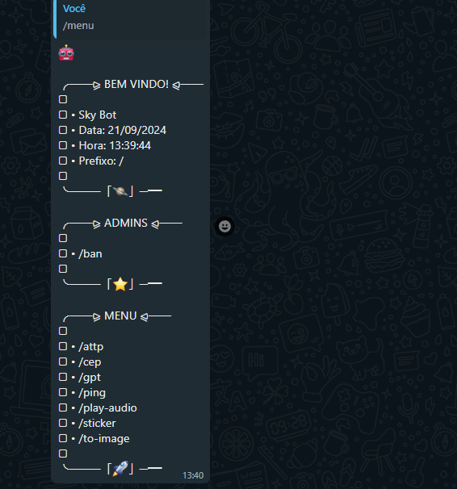

# 🤖 Sky Bot

<div align="center">
    
</div>

<br />

<div align="center">
    <a href="https://github.com/Projetos-Crescer/zig-app">
        
    </a>
</div>

<br />

Bot de WhatsApp multi funções, desenvolvido no vídeo:

[CRIANDO UM BOT DE WHATSAPP DO ZERO (GUIA DEFINITIVO) - BASE COMPLETA + 6 COMANDOS - JAVASCRIPT](https://youtu.be/6zr2NYIYIyc)


## Tecnologias envolvidas

- [Axios](https://axios-http.com/ptbr/docs/intro)
- [Baileys](https://github.com/WhiskeySockets/Baileys)
- [FFMPEG](https://ffmpeg.org/)
- [Node.js](https://nodejs.org/en)
- [Spider X API](https://api.spiderx.com.br)

## Instalação no Termux

1 - Abra o Termux e execute os seguintes comandos. Não tem o Termux? [Clique aqui e baixe a última versão.](https://www.mediafire.com/file/082otphidepx7aq/Termux_0.119.1_aldebaran_dev.apk/file)
```
pkg upgrade -y && pkg update -y && pkg install git -y
```

2 - Habilite o acesso da pasta storage, no termux.
```
termux-setup-storage
```

3 - Entre na pasta storage (ou dê antes um `ls` e veja qual é o nome da pasta do seu cartão de memória e entre nela).
```
cd storage
```

4 - Clone o repositório.
```
git clone https://github.com/guiireal/sky-bot
```

5 - Entre na pasta que foi clonada.
```
cd sky-bot
```

6 - Execute o bot.
```
sh termux-start.sh
```

7 - Insira o número de telefone e pressione `enter`.

8 - Informe o código que aparece no termux, no seu WhatsApp, [assista aqui, caso não encontre essa opção](https://youtu.be/6zr2NYIYIyc?t=5395).

9 - Aguarde 10 segundos, depois digite `CTRL + C` para parar o bot e rode novamente o seguinte comando.
```
npm start
```

## Alguns comandos necessitam de API

Edite a linha `21` do arquivo `./src/config.js` e cole sua api key da plataforma Spider X API.<br/>
Para obter seu token, acesse: [https://api.spiderx.com.br](https://api.spiderx.com.br) e crie sua conta gratuitamente!

```js
exports.SPIDER_API_TOKEN = "seu_token_aqui";
```
## Funcionalidades

| Função | Ativo? | Contexto |
| ------------ | --- | --- |
| Desligar o bot no grupo | ✔ | Dono |
| Ligar o bot no grupo | ✔ | Dono |
| Banir membros | ✔ | Admin |
| Busca CEP | ✔ | Membro |
| Figurinha de texto animada | ✔ | Membro |
| GPT | ✔ | Membro |
| Ping | ✔ | Membro |
| Play áudio | ✔ | Membro |
| Sticker | ✔ | Membro |
| Sticker para imagem | ✔ | Membro |

## Exemplo do menu



## Inscreva-se no canal!

<a href="https://www.youtube.com/@devgui_?sub_confirmation=1" target="_blank" rel="noopener noreferrer"></a>

## Licença

[MIT](https://github.com/guiireal/sky-bot/blob/main/LICENSE)

## ⚠ Disclaimer

Neste projeto, precisei hospedar a node_modules, para auxiliar quem está rodando o bot pelo celular, pois muitos deles podem não rodar o `npm install` pelo termux corretamente.
